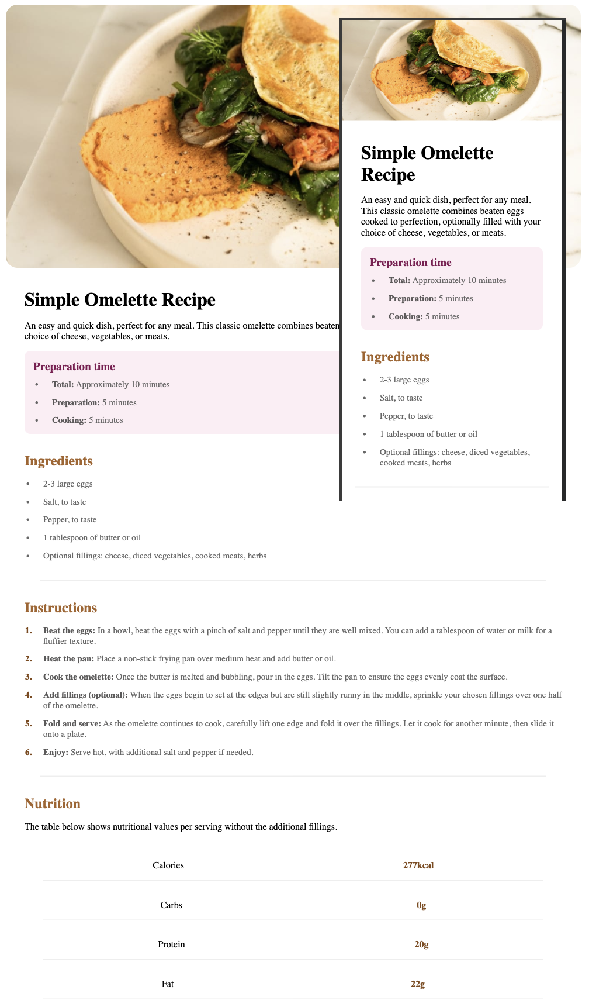

# Frontend Mentor - Recipe page solution

This is a solution to the [Recipe page challenge on Frontend Mentor](https://www.frontendmentor.io/challenges/recipe-page-KiTsR8QQKm). Frontend Mentor challenges help you improve your coding skills by building realistic projects. 

## Table of contents

- [Overview](#overview)
  - [Screenshot](#screenshot)
  - [Links](#links)
- [My process](#my-process)
  - [Built with](#built-with)
  - [What I learned](#what-i-learned)
  - [Continued development](#continued-development)
  - [Useful resources](#useful-resources)
- [Author](#author)


## Overview

### Screenshot



### Links

- Solution URL: [Add solution URL here](https://your-solution-url.com)
- Live Site URL: [Add live site URL here](https://your-live-site-url.com)

## My process

### Built with

- Semantic HTML5 markup
- CSS custom properties
- Flex-box
- CSS Grid
- Mobile-first workflow

### What I learned

```css
@media screen and (min-width: 1024px) {
  
  body {
    max-width: 1024px;
    margin: 0 auto;
    padding: 0 20px;
    box-sizing: border-box;
  }

  header img {
    width: 100%;
    height: auto;
    margin-top: 1rem;
    border-radius: 20px;
  }
}
```
Simple media query I'm proud of because I'm just getting use to using these queries and this seemed so simple. Makes me curious of how well I will get along with using media queries.

### Continued development

As stated above I am exited to continue using these media queries in future projects. I think it will be challenging, frustrating but fun trying to figure out how to make things flow naturally when the browser screens are adjusted.

### Useful resources

- [W3Schools](https://www.w3schools.com/) - As always W3 Schools coming in clutch with the all the useful information.
- [css tricks](https://css-tricks.com/) - Discovered this page a while back and man has changed the way I see css, not only is the information amazing but the interactive aspect of the information is great especially when it visually shows you how things work.

## Author

- Website - [Juan Vega](https://juantwofour.github.io/Recipe-Page/)
- Frontend Mentor - [@JuanTwoFour](https://juantwofour.github.io/Social-Profiles/)# Recipe-Page
